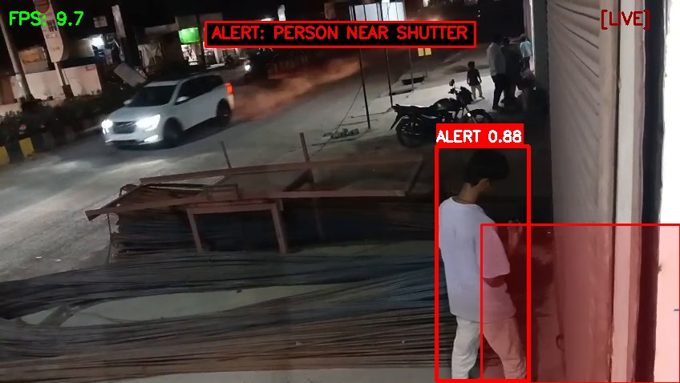
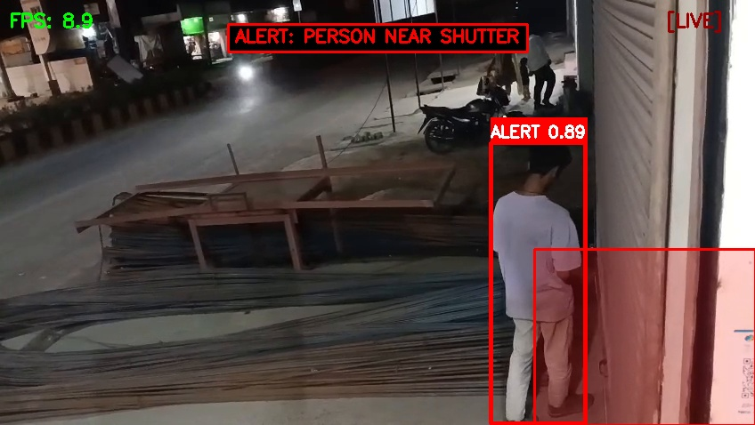
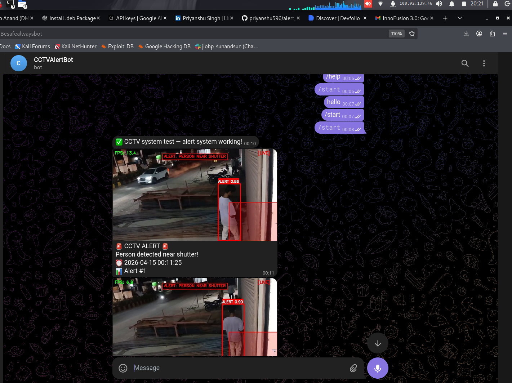

# 🎯 AI CCTV Surveillance System

A professional AI-powered CCTV surveillance demo with real-time person detection, zone-based intrusion alerts, WhatsApp notifications, and a modern cybersecurity-themed dashboard.


---

## 📋 Features

### 🖼️ Screenshots
| Detection Alert | Event Monitoring | Telegram Alert |
| :---: | :---: | :---: |
|  |  |  |

### 🧠 AI Detection
- **YOLOv8 Nano** for real-time person detection
- Filters only "person" class (COCO dataset class ID 0)
- Confidence threshold: 50%

### 🎯 Zone-Based Intrusion
- Configurable polygon restricted zone (ROI)
- Bottom-center point tracking (feet position)
- Visual zone overlay with semi-transparent fill

### 🚨 Alert System
- **20-second cooldown** between alerts
- **Screenshot capture** saved to `/snapshots`
- **Alarm sound** playback (cross-platform)
- **WhatsApp notification** via CallMeBot FREE API

### 🖥️ Professional Dashboard
- **Dark cybersecurity theme** with neon accents
- **Live video stream** with bounding boxes
- **Red highlight** for suspicious detections
- **Real-time event log** (timestamped)
- **Status panels**: Motion, AI Status, Cooldown, Total Alerts
- **Latest snapshot** display
- **FPS counter** and **LIVE indicator**
- **Responsive design** (desktop, tablet, mobile)

---

## 📁 Project Structure

```
safety/
├── app.py                  # Main Flask application
├── detector.py             # YOLOv8 person detection logic
├── alert.py                # Alert management (WhatsApp, sound, screenshots)
├── requirements.txt        # Python dependencies
├── README.md               # This file
│
├── templates/
│   └── index.html          # Dashboard UI
│
├── static/
│   ├── style.css           # Dark cybersecurity theme
│   └── alarm.wav           # Alarm sound file
│
└── snapshots/              # Alert screenshots (auto-created)
    └── alert_YYYYMMDD_HHMMSS.jpg
```

---

## 🚀 Quick Start

### 1. Install Dependencies

```bash
cd safety
pip install -r requirements.txt
```

**Note:** On first run, YOLOv8 will automatically download the model weights (~6MB).

### 2. Run the Application

```bash
python app.py
```

### 3. Open Dashboard

Navigate to: **http://localhost:5000**

---

## ⚙️ Configuration

### Video Source

By default, uses webcam (device 0). To use a video file:

```bash
VIDEO_SOURCE="path/to/video.mp4" python app.py
```

### Restricted Zone

The restricted zone polygon is defined in `app.py`:

```python
DEFAULT_ZONE = [(200, 500), (1080, 500), (1080, 720), (200, 720)]
```

**Format:** List of `(x, y)` tuples defining polygon vertices. Adjust coordinates to match your camera view.

### WhatsApp Alerts (FREE)

Using **CallMeBot** API: https://www.callmebot.com/blog/free-api-whatsapp-messages/

**Setup:**

1. Send "I allow callmebot" to **+34 611 23 15 64** (WhatsApp)
2. Wait for response with your API key
3. Set environment variables:

```bash
export WHATSAPP_PHONE="+1234567890"    # Your phone number (with country code)
export WHATSAPP_API_KEY="123456"        # API key received from CallMeBot
```

Or edit `alert.py` directly:

```python
self.whatsapp_phone = "+1234567890"     # Your number
self.whatsapp_api_key = "YOUR_API_KEY"  # Your API key
```

**Test alert** from dashboard: Click "Test Alert" button in Quick Actions panel.

### Alert Cooldown

Change cooldown period in `app.py`:

```python
alert_manager = AlertManager(cooldown_seconds=20, snapshots_dir="snapshots")
```

---

## 🌐 API Endpoints

| Endpoint | Description |
|----------|-------------|
| `/` | Main dashboard |
| `/video_feed` | MJPEG video stream |
| `/api/status` | System status JSON |
| `/api/events` | Full event log |
| `/api/alert_status` | Alert manager status |
| `/api/test_alert` | Trigger test alert |

---

## 🎨 Dashboard Features

### Live Video Feed
- Real-time object detection overlay
- **Green boxes**: Person outside restricted zone
- **Red boxes**: Person INSIDE restricted zone (ALERT)
- Semi-transparent red zone overlay
- FPS counter (top-left)
- LIVE indicator (top-right, blinking)

### System Status Panel
- **Motion Detection**: ALERT / MONITORING
- **AI Engine**: LOADING... / LIVE
- **Alert System**: ACTIVE / INACTIVE
- **Last Alert**: Timestamp of last alert
- **Total Alerts**: Counter
- **Cooldown**: Time remaining / Ready

### Event Log
- Timestamped events
- Color-coded by type:
  - 🔴 **Red**: Alerts
  - 🟠 **Orange**: Warnings
  - 🟢 **Green**: Success
  - 🔵 **Blue**: Info

### Latest Snapshot
- Displays most recent alert screenshot
- Updates automatically on new alerts

---

## 🔧 Troubleshooting

### Webcam not found
```bash
# Check available cameras
ls /dev/video*

# Or use a video file instead
VIDEO_SOURCE="test_video.mp4" python app.py
```

### Model download slow
The YOLOv8 model (~6MB) downloads on first run. If it fails:
```bash
python -c "from ultralytics import YOLO; YOLO('yolov8n.pt')"
```

### No sound
Alarm uses system audio players. Install if missing:
```bash
# Linux (ALSA)
sudo apt install alsa-utils

# Linux (PulseAudio)
sudo apt install pulseaudio-utils
```

### WhatsApp not sending
- Verify phone number format: **+** followed by country code and number
- Check API key from CallMeBot
- Test API manually:
  ```
  https://api.callmebot.com/send.php?phone=YOUR_PHONE&apikey=YOUR_KEY&text=Test
  ```

---

## 🧪 Testing

### Test with video file
```bash
VIDEO_SOURCE="sample.mp4" python app.py
```

### Test alert without detection
Click **"Test Alert"** button in dashboard Quick Actions panel.

### View API status
```bash
curl http://localhost:5000/api/status
```

---

## 📝 License

MIT License - Feel free to use for personal projects, demos, and learning.

---

## 🙏 Credits

- **YOLOv8**: Ultralytics (https://github.com/ultralytics/ultralytics)
- **CallMeBot**: Free WhatsApp API (https://www.callmebot.com)
- **Flask**: Pallets Projects (https://flask.palletsprojects.com)
- **OpenCV**: Open Source Computer Vision Library (https://opencv.org)

---

## 🎯 Demo Checklist

- [x] Install dependencies
- [x] Run `python app.py`
- [x] Open http://localhost:5000
- [x] See live video feed with AI detection
- [x] Person enters restricted zone → Alert triggers
- [x] Screenshot saved to `/snapshots`
- [x] WhatsApp message received
- [x] Dashboard shows impressive cybersecurity UI

**Enjoy your AI-powered surveillance demo! 🚀**
